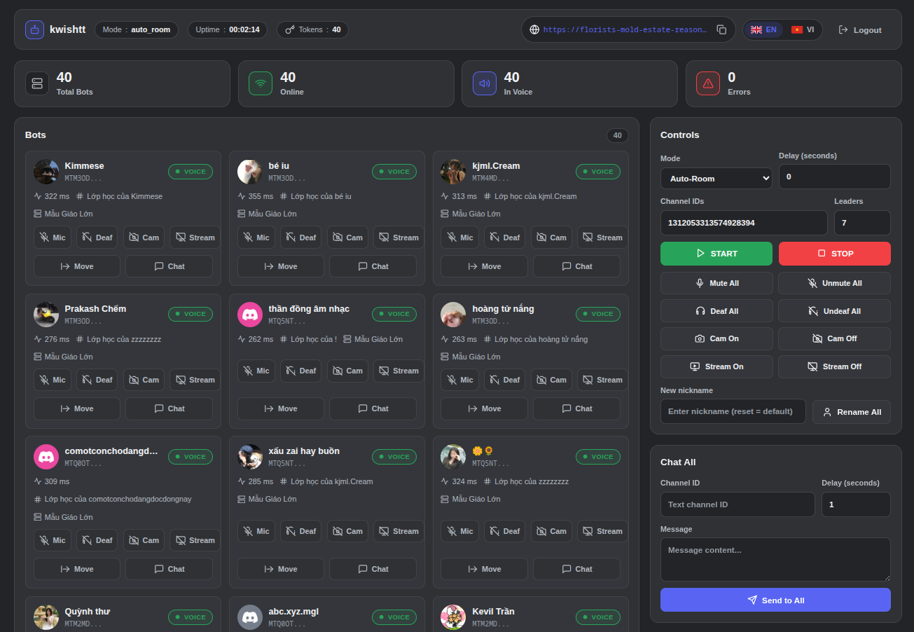

<div align="center">

[**🇬🇧 English →**](../README.md) &nbsp;·&nbsp; **🇻🇳 Tiếng Việt (đang xem)**

<h1>Discord Multi-Token Voice 24/7 &amp; Web Dashboard</h1>

**Vận hành hàng chục — hoặc hàng trăm — tài khoản Discord trong voice channel 24/7, qua web dashboard thời gian thực hiện đại hoặc giao diện dòng lệnh (Terminal CLI).**

[](https://www.python.org/)
[](https://fastapi.tiangolo.com/)
[](https://github.com/dolfies/discord.py-self)
[](#lộ-trình)
[](#giấy-phép-và-ghi-công)
[](#cài-đặt)

<a href="#tổng-quan">Tổng quan</a> ·
<a href="#tính-năng-chính">Tính năng</a> ·
<a href="#web-dashboard">Dashboard</a> ·
<a href="#cài-đặt">Cài đặt</a> ·
<a href="#cấu-hình">Cấu hình</a> ·
<a href="#kiến-trúc">Kiến trúc</a> ·
<a href="#terminal-cli">Terminal CLI</a> ·
<a href="#công-cụ-token">Công cụ Token</a> ·
<a href="#rest-api">REST API</a> ·
<a href="#bảo-mật-và-quyền-riêng-tư">Bảo mật</a> ·
<a href="#khắc-phục-sự-cố">Khắc phục sự cố</a>

<br><br>



</div>

---

> [!WARNING]
> **Điều khoản dịch vụ của Discord.** Dự án này tự động hoá **tài khoản người dùng** Discord (hành vi self-bot). Việc này vi phạm Điều khoản dịch vụ của Discord và có thể dẫn tới **khoá tài khoản vĩnh viễn**. Chỉ dùng cho các tài khoản bạn sở hữu hoàn toàn và chỉ khi bạn chấp nhận rủi ro.
>
> **Quyền riêng tư của token.** `tokens.txt`, `.env` và mọi file `*.txt` xuất ra đều chứa thông tin đăng nhập tài khoản. Không bao giờ commit chúng, không chụp màn hình chia sẻ, và không chia sẻ URL Cloudflare tunnel kèm mật khẩu dashboard. `.gitignore` đã loại trừ các file này — hãy giữ nguyên như vậy.

## Tổng quan

**Discord Multi-Token Voice 24/7** là trình quản lý voice đa tài khoản xây dựng trên `discord.py-self`. Dự án giữ số lượng token tuỳ ý kết nối voice/stage channel liên tục, và cung cấp hai cách điều khiển:

| Giao diện | Điểm khởi chạy | Mô tả |
| :--- | :--- | :--- |
| **Web Dashboard** | `dashboard.py` (`core/web.py`, `core/api.py`) | Ứng dụng single-page nền tối do FastAPI phục vụ, kênh WebSocket thời gian thực, UI song ngữ EN/VI, điều khiển từng bot, log trực tiếp, trình quản lý token và tuỳ chọn URL công khai qua Cloudflare. |
| **Terminal CLI** | `self-bot.py` | Giao diện console gốc: chọn chế độ, nhịp đăng nhập, menu điều khiển hàng loạt mic / camera / deafen / reaction / đổi tên. |

Cả hai giao diện dùng chung engine (`core/engine.py`), cấu hình (`config.py` + `.env`) và file `tokens.txt`, nên bạn có thể chuyển đổi qua lại bất kỳ lúc nào.

> [!NOTE]
> Web dashboard hoạt động theo cơ chế **push**: sức khoẻ bot, độ trễ, trạng thái voice và log console được truyền qua WebSocket, tự kết nối lại mỗi 3 giây. Đổi ngôn ngữ (EN ⇄ VI) diễn ra tức thì, không tải lại trang.

## Tính năng chính

### Tự động hoá Voice

- **Normal Mode** — nhập một hoặc nhiều voice channel ID; token được chia đều theo vòng tròn (round-robin) giữa các kênh.
- **Auto-Room Mode** — số lượng token *leader* (mặc định 5) vào lobby; khi server bot di chuyển họ sang phòng mới, các token còn lại được phân phối vào tất cả phòng phát hiện được.
- **Duy trì 24/7** — bot giữ phiên voice, báo độ trễ gateway và hiển thị lỗi kết nối theo thời gian thực.

### Web Dashboard hiện đại (`dashboard.py`, `core/web.py`)

- **WebSocket thời gian thực** (`/ws`): sức khoẻ bot, độ trễ, trạng thái voice, trạng thái stream và log console trực tiếp.
- **Không phụ thuộc bên ngoài** — toàn bộ HTML, CSS, JavaScript và icon SVG được nhúng inline; không CDN, không build step, không framework.
- **Song ngữ tức thì** — chuyển đổi English / Tiếng Việt với **119 key mỗi ngôn ngữ** (tương thích 100%), lưu lựa chọn trong `localStorage`.
- **Điều khiển toàn cục và từng bot** — mute, deafen, camera, mô phỏng Go-Live stream, di chuyển kênh, chat riêng.
- **Bảng Discord Message Reaction** — kiểm tra snowflake (17–20 chữ số), bộ chọn emoji hai chế độ (lưới 24 emoji + nhập `:name:` / `name:id`), preview trực tiếp, spinner khi gửi và toast trạng thái.
- **Chat Single & Chat All** — gửi tin nhắn từ một tài khoản, hoặc từ mọi tài khoản đã sẵn sàng với delay tuỳ chỉnh (mặc định 1.0 giây, bước 0.1).
- **Trình quản lý Token tích hợp** — xem token đã che/đầy đủ, chỉnh sửa và lưu, tự động sao lưu `.bak` trước mỗi lần ghi.
- **Tích hợp Cloudflare Tunnel** (`core/tunnel.py`) — tự khởi động `cloudflared`, cung cấp URL công khai an toàn cho truy cập từ xa, kèm nút copy một chạm.

### Công cụ Token (`Token Tools/`)

- `get_token.py` — đăng nhập qua trình duyệt và trích xuất token (kèm báo cáo thông tin tài khoản).
- `check_info_token.py` — kiểm tra hàng loạt tính hợp lệ và trạng thái tài khoản.
- `browser_login.py` — kiểm tra đăng nhập một chạm bằng `undetected-chromedriver`.

### Ma trận giao diện

| Khả năng | Web Dashboard | Terminal CLI |
| :--- | :---: | :---: |
| Trạng thái & log thời gian thực | ✅ WebSocket push | ⚠️ Chỉ log văn bản |
| Đa ngôn ngữ | ✅ EN / VI tức thì | ⚠️ Console tiếng Việt |
| Xác thực | ✅ Mật khẩu + JWT | ❌ Chỉ terminal cục bộ |
| Truy cập từ xa | ✅ Cloudflare tunnel | ⚠️ SSH |
| Chế độ Normal / Auto-Room | ✅ | ✅ |
| Bulk mute / deaf / cam / stream | ✅ 8 hành động | ⚠️ Toggle trong menu |
| Mic / deaf / cam / stream từng bot | ✅ | ❌ |
| Di chuyển bot cụ thể | ✅ Modal chọn kênh | ❌ |
| Chat riêng từng bot | ✅ Modal riêng | ❌ |
| Chat all / spam chat | ✅ Có delay | ❌ |
| Thả reaction | ✅ Lưới emoji + nhập tay | ✅ Nhập trong menu |
| Quản lý token | ✅ Xem / sửa / lưu | ❌ Sửa file thủ công |
| Đổi tên (một / tất cả) | ✅ | ✅ Đổi tên tất cả |

## Web Dashboard

<p align="center">
  
</p>

```
GET /            →   Dashboard single-page (HTML/CSS/JS inline)
GET /ws          →   Kênh realtime đã xác thực (state_update · log · tunnel_status)
```

### Bố cục

1. **Màn hình đăng nhập** — card mật khẩu tối giản, có nút hiện/ẩn mật khẩu và chuyển EN/VI. JWT lưu trong `localStorage` và tự đăng nhập lại khi tải trang.
2. **Header** — thương hiệu, pill chế độ + thời gian chạy, pill **Tokens** (tổng số token), URL Cloudflare tunnel kèm nút copy, chuyển ngôn ngữ, đăng xuất.
3. **4 stat card** — Tổng số Bot · Online · Trong Voice · Lỗi (cập nhật trực tiếp).
4. **Lưới Bot** — mỗi tài khoản một card: avatar, tên, badge trạng thái (`VOICE` / `READY` / `ERROR` / `CONNECTING`), ping, kênh và guild, kèm điều khiển riêng: **Mic · Deaf · Cam · Stream · Move · Chat**.
5. **Bảng điều khiển** — chọn chế độ, channel IDs, delay, số leader, `START` / `STOP`, 8 hành động hàng loạt, đổi tên tất cả.
6. **Bảng Chat All** — ID kênh văn bản (ghi nhớ qua `localStorage`), nội dung, delay, nút “Gửi tất cả”.
7. **Bảng Message Reaction** — channel ID, message ID, lưới emoji / nhập tay, preview, nút “Gửi Reaction”.
8. **Log Console trực tiếp** — khung 300 px tự cuộn, tô màu theo mức (`INFO` / `WARNING` / `ERROR` / `DEBUG`), có nút xoá log.
9. **Trình quản lý Token** — khối thu gọn để chỉnh sửa `tokens.txt`.

### Phím tắt

| Phím | Hành động |
| :--- | :--- |
| <kbd>Enter</kbd> | Gửi mật khẩu dashboard ở màn hình đăng nhập |
| <kbd>Esc</kbd> | Đóng hộp thoại xác nhận, modal chọn kênh, modal chat hoặc bộ chọn emoji |
| <kbd>Ctrl</kbd> + <kbd>Enter</kbd> (hoặc <kbd>⌘</kbd> + <kbd>Enter</kbd>) | Gửi tin nhắn trong modal chat riêng |
| <kbd>Ctrl</kbd> + <kbd>C</kbd> | Dừng dashboard (tắt an toàn: đóng toàn bộ bot và tunnel) |

### Ghi chú hành vi

- Các hành động hàng loạt và thao tác không thể hoàn tác (`STOP`, `Lưu Token`, `Đổi tên tất cả`) sẽ hỏi xác nhận trước.
- Mọi lời gọi API đều gắn `Authorization: Bearer <JWT>`; token hết hạn sẽ tự động đăng xuất về màn hình đăng nhập.
- WebSocket tự kết nối lại mỗi 3 giây khi tab vẫn mở.

## Cài đặt

> [!IMPORTANT]
> - Yêu cầu **Python 3.10+** (khuyến nghị 3.11/3.12; môi trường tham chiếu chạy 3.12).
> - **Lần chạy đầu tiên sẽ hỏi mật khẩu dashboard** trong terminal và tự tạo `.env`. Prompt này cần terminal tương tác — trên server headless hãy tạo `.env` thủ công (xem [Cấu hình](#cấu-hình)).
> - Cloudflare Tunnel bật mặc định (`ENABLE_TUNNEL=true`) và cần `cloudflared` — xem [mẹo Cloudflare](#truy-cập-từ-xa-với-cloudflare-tunnel).

### Yêu cầu hệ thống

| Yêu cầu | Ghi chú |
| :--- | :--- |
| Python 3.10+ | `python3 --version` |
| pip | Thường đi kèm Python |
| Git | Để clone repository |
| `cloudflared` *(tuỳ chọn)* | Chỉ cần cho tunnel truy cập từ xa |
| Google Chrome *(tuỳ chọn)* | Chỉ cần cho `Token Tools/` |

### Khởi động nhanh

**Windows**

```bat
run.bat
```

`run.bat` tự tạo môi trường ảo `.venv` nếu chưa có, cài `requirements.txt` và chạy dashboard.

**Linux / macOS**

```bash
chmod +x run.sh
./run.sh
```

> [!TIP]
> **Chạy trên VPS headless.** Hãy khởi động trong `tmux` hoặc `screen` để dashboard không tắt khi mất SSH:
> ```bash
> tmux new -s dashboard
> ./run.sh
> # tách phiên bằng Ctrl+B rồi D — quay lại bằng: tmux attach -t dashboard
> ```

### Cài đặt thủ công

```bash
# 1. Clone
git clone https://github.com/kwishtt/Discord-Multi-Voice.git
cd Discord-Multi-Voice

# 2. Tạo môi trường ảo
python3 -m venv .venv

# 3. Kích hoạt
source .venv/bin/activate        # Linux / macOS
.venv\Scripts\activate.bat       # Windows

# 4. Cài thư viện
pip install --upgrade pip
pip install -r requirements.txt

# 5. Thêm token của bạn (mỗi dòng một token, không dấu ngoặc kép)
#    tokens.txt

# 6. Chạy dashboard
python dashboard.py
```

Terminal sẽ in banner kèm hai địa chỉ truy cập:

```text
 Dashboard đang chạy!

 Truy cập LAN   : http://192.168.1.20:8080
 Truy cập Remote: https://random-words-here.trycloudflare.com

 Bấm Ctrl+C để dừng hệ thống.
```

## Cấu hình

### Biến môi trường (`.env`)

File `.env.example` ghi chú mọi biến được hỗ trợ. Ở lần chạy đầu, dashboard sẽ hỏi mật khẩu và tạo `.env` tự động.

| Biến | Mặc định | Mô tả |
| :--- | :--- | :--- |
| `HOST` | `0.0.0.0` | Giao diện mạng dashboard lắng nghe |
| `PORT` | `8080` | Cổng dashboard |
| `DASHBOARD_PASSWORD` | *(hỏi khi chạy)* | Mật khẩu đăng nhập dashboard |
| `JWT_SECRET` | *(tự sinh)* | Khoá ký HS256 (`secrets.token_hex(32)`) |
| `JWT_ALGORITHM` | `HS256` | Thuật toán ký JWT |
| `JWT_EXPIRE_HOURS` | `72` | Thời hạn phiên đăng nhập (giờ) |
| `TOKENS_FILE` | `tokens.txt` | Đường dẫn file token (đường dẫn tương đối neo theo thư mục project) |
| `ENABLE_TUNNEL` | `true` | Tự khởi động Cloudflare quick tunnel khi chạy |
| `CLOUDFLARED_PATH` | `/usr/local/bin/cloudflared` | Đường dẫn binary `cloudflared` (có fallback tìm trong `PATH`) |

Prompt lần chạy đầu:

```text
Đặt mật khẩu dashboard: █
```

> [!IMPORTANT]
> Dashboard không lưu mật khẩu của bạn — chỉ lưu khoá bí mật JWT. Hãy coi `.env` là file thông tin đăng nhập: file này đã nằm trong `.gitignore`.

### Định dạng file token

`tokens.txt` chứa **mỗi dòng một token**, không dấu ngoặc kép, không chú thích:

```text
MTIzNDU2Nzg5MDEyMzQ1Njc4OTAuQUJDREVGLmFiY2RlZmdoaWprbG1ub3BxcnN0dXZ3eHl6
MTIzNDU2Nzg5MDEyMzQ1Njc4OTAuQUJDREVGLnp6enp6enp6enp6enp6enp6enp6enp6enp6
```

Quy tắc:

- Mỗi dòng một token; dòng trống được bỏ qua.
- Token ngắn hơn 5 ký tự bị engine bỏ qua.
- Khi lưu từ dashboard, file được ghi an toàn và nội dung cũ được giữ trong `tokens.txt.bak`.
- `TOKENS_FILE` có thể trỏ tới bất kỳ đâu; đường dẫn tương đối được neo vào thư mục project, nên dashboard hoạt động nhất quán dù bạn chạy từ thư mục nào.

## Kiến trúc

```text
Trình duyệt (SPA, EN/VI, Vanilla JS)
   │  REST + WebSocket  (JWT)
   ▼
FastAPI  (core/api.py · core/web.py · core/auth.py)
   │
   ├── core/engine.py      Bot / BotManager  ──►  các client discord.py-self ──► Discord Gateway & Voice
   ├── core/logger.py      WebSocketLogHandler (buffer log → dashboard)
   └── core/tunnel.py      CloudflareTunnelManager ──► cloudflared quick tunnel
```

<details>
<summary><strong>Cây thư mục dự án (bấm để mở)</strong></summary>

```text
Discord_Voice/
├── README.md                     # Tài liệu này (tiếng Anh)
├── config.py                     # Bộ nạp cấu hình có type hint + first-run setup (.env)
├── dashboard.py                  # Điểm khởi chạy web dashboard (FastAPI + uvicorn + banner)
├── self-bot.py                   # Terminal CLI (giao diện cũ, giữ nguyên)
├── run.sh                        # Launcher Linux / macOS (tạo .venv, cài đặt, chạy)
├── run.bat                       # Launcher Windows
├── requirements.txt              # Phụ thuộc Python
├── .env.example                  # Mẫu biến môi trường có chú thích
├── tokens.txt                    # Token Discord của bạn (mỗi dòng một token — gitignored)
├── tokens.txt.bak                # Bản sao lưu tự động trước mỗi lần lưu
├── dead_tokens.txt               # Token bị công cụ kiểm tra đánh dấu không hợp lệ
├── token_details.csv             # Chi tiết tài khoản do công cụ kiểm tra xuất ra
├── evs.txt / user_info.txt       # Kết quả của công cụ trích xuất token
├── core/
│   ├── __init__.py
│   ├── api.py                    # Router REST (/api/*)
│   ├── auth.py                   # Tạo/kiểm tra JWT + middleware xác thực HTTP
│   ├── engine.py                 # Bot + BotManager (voice, toggle, chat, reaction, stream)
│   ├── logger.py                 # Log handler đẩy qua WebSocket + app logger
│   ├── tunnel.py                 # Quản lý Cloudflare quick tunnel
│   └── web.py                    # Dashboard single-page + endpoint /ws
├── Token Tools/
│   ├── get_token.py              # Đăng nhập trình duyệt → trích xuất token
│   ├── check_info_token.py       # Kiểm tra hợp lệ hàng loạt
│   └── browser_login.py          # Kiểm tra đăng nhập một chạm
└── docs/
    ├── README_VN.md              # Tài liệu tiếng Việt (bản dịch của tài liệu này)
    └── GUIDE_VN.md               # Hướng dẫn triển khai VPS 24/7 (tiếng Việt)
```

</details>

<details>
<summary><strong>Các module lõi (bấm để mở)</strong></summary>

| Module | Trách nhiệm |
| :--- | :--- |
| `config.py` | Nạp `.env` bằng `python-dotenv`, cung cấp singleton `AppConfig` có type hint, hỏi mật khẩu dashboard lần đầu và sinh `JWT_SECRET`. |
| `core/engine.py` | `Bot` (mỗi token một instance): join voice, toggle mic/deaf/cam, mô phỏng stream (opcode 18/19), đổi tên, gửi tin nhắn, `bot_id` duy nhất, tuần tự hoá độ trễ/uptime/state. `BotManager`: đọc/ghi token, chế độ Normal & Auto-Room, toggle hàng loạt + từng bot, di chuyển, chat, reaction, đổi tên, summary, listener state. |
| `core/api.py` | Router FastAPI với toàn bộ endpoint REST, model Pydantic, xử lý 400/401. |
| `core/auth.py` | `create_token` / `verify_token` (PyJWT, HS256) và `auth_middleware` bảo vệ mọi route trừ `/`, `/api/login`, `/favicon.ico`. |
| `core/logger.py` | Handler buffer log (500 bản ghi) đẩy log tới listener WebSocket từ mọi thread. |
| `core/tunnel.py` | Chạy `cloudflared tunnel --url http://127.0.0.1:<port>`, phân tích URL `trycloudflare.com` với timeout 25 giây, đọc tiếp output và dọn process group khi dừng. |
| `core/web.py` | Phục vụ SPA inline và kênh `/ws` đã xác thực (handshake → `state_update` + `logs_history` + `tunnel_status` → stream trực tiếp). |

</details>

## Terminal CLI

`self-bot.py` vẫn là giao diện terminal gốc và **không bị sửa đổi** trong quá trình phát triển web dashboard. Phù hợp cho phiên chạy cục bộ nhanh hoặc khi bạn thích dùng console.

```bash
python self-bot.py
```

| Bước | Diễn biến |
| :--- | :--- |
| 1 | Chọn chế độ: `1` Normal (nhập channel IDs) hoặc `2` Auto-Room (lobby + leader). |
| 2 | Chọn nhịp đăng nhập: *Turbo* (<kbd>y</kbd>, delay 3 giây) hoặc *Safe* (<kbd>Enter</kbd>, delay 8 giây). |
| 3 | Bot đăng nhập và vào voice; menu điều khiển xuất hiện. |

Hành động trong menu: toggle mic (`1`), camera (`2`), deafen (`3`), spam reaction (`4`), đổi tên tất cả (`5`), thoát (`6`).

<details>
<summary><strong>Lệnh echo của owner (bấm để mở)</strong></summary>

Tài khoản có Discord user ID khớp hằng số `OWNER_ID` đã cấu hình có thể khiến mọi bot lặp lại tin nhắn bằng cú pháp:

```text
<!nội dung tin nhắn>
```

Mỗi bot chờ ngẫu nhiên 0.5–2.5 giây trước khi gửi, tránh dồn tin nhắn cùng lúc. Cấu hình owner ID trực tiếp trong `self-bot.py` (`OWNER_ID`) và trong `core/engine.py` cho engine của dashboard.

</details>

> [!NOTE]
> Terminal CLI không có lớp xác thực — chỉ người có quyền truy cập shell mới điều khiển được. Muốn truy cập từ xa, hãy dùng web dashboard với đăng nhập JWT và (tuỳ chọn) Cloudflare tunnel.

## Công cụ Token

<details>
<summary><strong><code>Token Tools/get_token.py</code> — đăng nhập trình duyệt &amp; trích xuất token (bấm để mở)</strong></summary>

Mở Discord trên cửa sổ Chrome thật (qua `undetected-chromedriver`), chờ bạn đăng nhập thủ công, trích xuất token từ phiên trình duyệt rồi ghi thêm các file:

- `tokens.txt` — bản thân token (mỗi dòng một token).
- `evs.txt` — `email:username:user_id:token`.
- `user_info.txt` — báo cáo định dạng sẵn (ID, username, e-mail, phone, MFA, verified, Nitro, token).

> [!TIP]
> Hãy chạy các công cụ **từ thư mục gốc repository** (`python "Token Tools/get_token.py"`) để file kết quả nằm cạnh `tokens.txt` của dashboard.

</details>

<details>
<summary><strong><code>Token Tools/check_info_token.py</code> — kiểm tra hợp lệ hàng loạt (bấm để mở)</strong></summary>

Đọc toàn bộ token từ `tokens.txt`, gọi đồng thời `GET /users/@me`, sau đó ghi lại kết quả:

- `tokens.bak` — bản sao lưu danh sách đầu vào.
- `tokens.txt` — chỉ giữ token **hợp lệ** (đã loại trùng).
- `dead_tokens.txt` — token không hợp lệ để bạn kiểm tra lại.
- `token_details.csv` — `Token, Username, Email, Phone, Verified` cho mọi tài khoản hợp lệ.

Hãy chạy công cụ này mỗi khi bot đăng nhập thất bại — token hết hạn/thu hồi là nguyên nhân phổ biến nhất.

</details>

<details>
<summary><strong><code>Token Tools/browser_login.py</code> — kiểm tra đăng nhập (bấm để mở)</strong></summary>

Script tối giản mở phiên Chrome ẩn danh để xác nhận token còn đăng nhập được vào Discord web. Hữu ích trước khi đưa tài khoản vào fleet lớn.

</details>

## REST API

Mọi endpoint nằm dưới `/api`. Ngoại trừ `POST /api/login`, mọi request phải gửi `Authorization: Bearer <JWT>`; thiếu hoặc sai sẽ nhận `401 {"error": "Unauthorized"}`.

| Method | Endpoint | Body / Query | Response |
| :--- | :--- | :--- | :--- |
| `POST` | `/api/login` | `{"password": "..."}` | `{"token", "expires_in"}` · `401 {"error":"Sai mật khẩu"}` |
| `GET` | `/api/status` | — | Summary bot kèm trạng thái tunnel |
| `POST` | `/api/start` | `{"mode": "normal"\|"auto_room", "channel_ids": ["..."], "delay": 5, "leader_count": 5}` | `{"success", "message"}` (chạy nền) |
| `POST` | `/api/stop` | — | `{"success", "message"}` |
| `POST` | `/api/toggle` | `{"bot_id"?, "mute"?, "deaf"?, "video"?, "stream"?}` | `{"success", "affected"}` |
| `POST` | `/api/rename` | `{"bot_id"?, "name": "..."}` | `{"success", "affected"}` |
| `POST` | `/api/move` | `{"target_channel_id": "...", "bot_ids"?: ["..."]}` | `{"success", "moved"}` |
| `POST` | `/api/reaction` | `{"channel_id", "message_id", "emoji"}` | `{"success", "reacted"}` |
| `POST` | `/api/chat/single` | `{"bot_id", "channel_id", "message"}` | `{"success", "sent": 0\|1}` |
| `POST` | `/api/chat/all` | `{"channel_id", "message", "delay": 1.0}` | `{"success", "sent": N}` |
| `GET` | `/api/bots/{bot_id}/voice-channels` | — | `{"channels": [{"id","name","guild_name","user_limit","member_count"}]}` |
| `GET` | `/api/tokens` | — | `{"count", "tokens": [{"index","masked","full"}]}` |
| `PUT` | `/api/tokens` | `{"tokens": ["..."]}` | `{"success", "count"}` |
| `GET` | `/api/logs` | — | `{"logs": [...]}` |
| `DELETE` | `/api/logs` | — | `{"success"}` |

**Định danh bot** — `bot_id` là Discord user ID (`str(user.id)`) khi tài khoản đã đăng nhập, và là `tok-<sha256-prefix>` ổn định khi chưa. Cả API lẫn UI đều dùng giá trị này, nên thao tác từng bot luôn nhắm đúng tài khoản, kể cả khi token trùng 6 ký tự đầu.

<details>
<summary><strong>Giao thức WebSocket (<code>/ws</code>) — bấm để mở</strong></summary>

1. Client kết nối và gửi `{"type": "auth", "token": "<JWT>"}` trong vòng 10 giây.
2. Token sai/thiếu → `{"type": "error", "message": "Unauthorized"}` và kết nối đóng.
3. Khi thành công, server đẩy lần lượt:
   - `{"type": "state_update", "data": { ... }}`
   - `{"type": "logs_history", "data": [ ... ]}`
   - `{"type": "tunnel_status", "data": { ... }}`
4. Sau đó kết nối stream liên tục `state_update` và `log`. Listener được gỡ tự động khi ngắt kết nối.

```bash
# Kiểm tra nhanh bằng curl (REST)
curl -s http://127.0.0.1:8080/api/login \
  -H 'Content-Type: application/json' \
  -d '{"password":"mật-khẩu-dashboard-của-bạn"}'
```

</details>

## Bảo mật và Quyền riêng tư

> [!WARNING]
> - **Tài khoản Discord có thể bị khoá** do hành vi self-bot. Đây là đặc tính của dự án, không phải lỗi.
> - Hãy coi token như mật khẩu: ai giữ token là kiểm soát tài khoản cho tới khi phiên bị thu hồi.
> - Cloudflare tunnel công khai dashboard ra internet — luôn giữ `DASHBOARD_PASSWORD` mạnh khi bật tunnel.

Danh sách tăng cường bảo mật:

- [x] `.env`, `tokens.txt` và mọi file `*.txt` đều bị `.gitignore` loại trừ.
- [x] Phiên dashboard ký JWT (HS256) và hết hạn sau `JWT_EXPIRE_HOURS` (mặc định 72 giờ).
- [x] Mỗi lần lưu token đều giữ bản `.bak` của file trước đó.
- [ ] Đổi `JWT_SECRET` sau khi chia sẻ URL tunnel cho bất kỳ ai.
- [ ] Tắt tunnel (`ENABLE_TUNNEL=false`) nếu chỉ cần truy cập trong LAN.

## Khắc phục sự cố

<details>
<summary><strong>Prompt hỏi mật khẩu lần đầu không xuất hiện (headless / systemd / CI)</strong></summary>

`first_run_setup()` dùng `getpass`, cần terminal tương tác. Hãy tạo `.env` thủ công trước khi chạy:

```bash
cp .env.example .env
# sau đó sửa: DASHBOARD_PASSWORD và JWT_SECRET
```

Sinh khoá bí mật bằng:

```bash
python -c "import secrets; print(secrets.token_hex(32))"
```

</details>

<details>
<summary><strong>“Không tìm thấy file token” / token không được nạp</strong></summary>

- Đảm bảo `tokens.txt` tồn tại cạnh `dashboard.py` (hoặc trỏ `TOKENS_FILE` đúng file).
- Kiểm tra định dạng: **mỗi dòng một token**, không dấu ngoặc kép, không dấu phẩy.
- Dùng `Token Tools/check_info_token.py` để phát hiện token bị thu hồi.
- Dashboard nạp token từ đĩa mỗi lần khởi động và đọc lại file mỗi lần mở Trình quản lý Token.

</details>

<details>
<summary><strong>“Cloudflare Tunnel không khả dụng”</strong></summary>

- Cài `cloudflared` (ví dụ `sudo dnf install cloudflared` hoặc tải từ Cloudflare).
- Cập nhật `CLOUDFLARED_PATH` trong `.env` nếu binary không nằm ở `/usr/local/bin/cloudflared`.
- Trình quản lý cũng fallback qua `shutil.which("cloudflared")` và chờ tối đa 25 giây cho URL công khai. Nếu mạng chặn Cloudflare, hãy tắt tunnel bằng `ENABLE_TUNNEL=false`.

</details>

<details>
<summary><strong>Cổng 8080 đang được dùng</strong></summary>

Đổi `PORT` trong `.env` (ví dụ `PORT=8090`) rồi khởi động lại. Trên Linux có thể xác định tiến trình đang giữ cổng bằng `ss -ltnp | grep 8080`.

</details>

<details>
<summary><strong>Dashboard liên tục yêu cầu đăng nhập lại / 401 mọi nơi</strong></summary>

Phiên hết hạn sau `JWT_EXPIRE_HOURS` (mặc định 72 giờ). Đăng nhập lại hoặc tăng giá trị trong `.env`. Nếu bị ngay lập tức, kiểm tra `JWT_SECRET` không rỗng và đồng hồ hệ thống chính xác.

</details>

<details>
<summary><strong>Reaction / chat / move thất bại</strong></summary>

- Channel ID và message ID phải là **snowflake** (17–20 chữ số).
- Emoji tuỳ chỉnh cần dạng `name:id` (ví dụ `pepe:123456789012345678`); dạng viết tắt `:pepe:` được chấp nhận khi nhập nhưng cần ID số để gửi lên Discord.
- Tài khoản phải còn là thành viên guild và có quyền dùng kênh.
- Move yêu cầu bot đã đăng nhập; modal chọn kênh liệt kê mọi voice/stage channel trong các guild của bot.

</details>

<details>
<summary><strong>Bot không vào voice / không hoạt động</strong></summary>

- Xác nhận channel ID thuộc đúng guild với token.
- Bắt đầu với số lượng nhỏ: Discord giới hạn tần suất đăng nhập hàng loạt.
- Theo dõi log console để tìm `Token không hợp lệ`, lỗi quyền, hoặc `Channel ID ... not found`.

</details>

<details>
<summary><strong>Không mở được dashboard từ máy khác</strong></summary>

- Giữ `HOST=0.0.0.0` và mở cổng trên firewall (`firewalld`, `ufw`, hoặc security group của VPS).
- Dùng URL **LAN** in khi khởi động, hoặc bật tunnel để truy cập mọi nơi.

</details>

<details>
<summary><strong><code>./run.sh: Permission denied</code></strong></summary>

```bash
chmod +x run.sh
./run.sh
```

</details>

## Lộ trình

Đã hoàn thành:

- [x] Bộ nạp cấu hình có type hint, tự tạo `.env` lần đầu
- [x] Engine `Bot` / `BotManager` với chế độ Normal và Auto-Room
- [x] REST API xác thực JWT kèm middleware
- [x] Dashboard WebSocket thời gian thực (state, log, trạng thái tunnel)
- [x] UI song ngữ — 119 key mỗi ngôn ngữ, chuyển tức thì
- [x] Điều khiển voice từng bot và hàng loạt (mic, deaf, cam, stream)
- [x] Modal di chuyển kênh, chat riêng, chat-all có delay
- [x] Bảng Message Reaction với lưới emoji và kiểm tra snowflake
- [x] Trình quản lý Token tích hợp, tự động sao lưu
- [x] Tích hợp Cloudflare quick tunnel
- [x] Giữ nguyên Terminal CLI song song dashboard

Đang cân nhắc:

- [ ] Triển khai Docker Compose để cài VPS bằng một lệnh
- [ ] Giám sát sức khoẻ token tự động theo lịch
- [ ] Biểu đồ độ trễ và uptime từng bot trong dashboard
- [ ] Tài khoản phân quyền cho dashboard nhiều người vận hành

## Giấy phép và Ghi công

Repository hiện **chưa có file `LICENSE`**. Trừ khi giấy phép được bổ sung, tác giả giữ mọi quyền — hãy liên hệ maintainer trước khi phân phối lại hoặc tái sử dụng mã nguồn.

- **Tác giả / maintainer:** [kwishtt](https://github.com/kwishtt)
- **Repository:** [github.com/kwishtt/Discord-Multi-Voice](https://github.com/kwishtt/Discord-Multi-Voice/tree/main)
- **Xây dựng trên:** [discord.py-self](https://github.com/dolfies/discord.py-self), [FastAPI](https://fastapi.tiangolo.com/), [Uvicorn](https://www.uvicorn.org/), [PyJWT](https://pyjwt.readthedocs.io/), [python-dotenv](https://github.com/theskumar/python-dotenv), [Cloudflare Tunnel](https://developers.cloudflare.com/cloudflare-one/connections/connect-networks/do-more-with-tunnels/trycloudflare/)

<div align="center">

**[⬆ Lên đầu trang](#tổng-quan)** · [🇬🇧 Read in English](../README.md)

<sub>Hãy sử dụng có trách nhiệm — bạn hoàn toàn chịu trách nhiệm về cách dùng phần mềm và các tài khoản mình vận hành.</sub>

</div>
